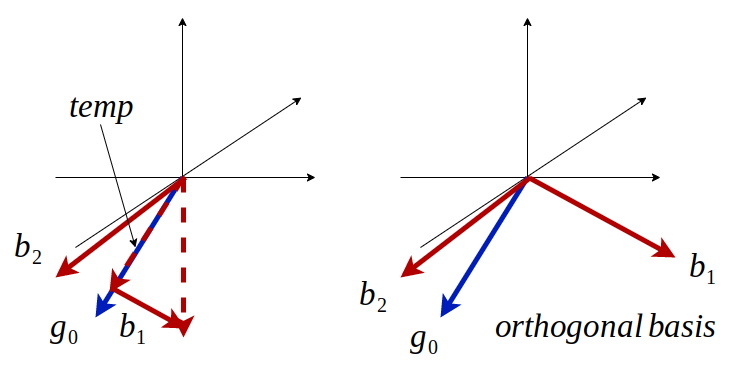

# Refined Gravity 
在VINS的初始化當中，有針對重力去優化

一般來說重力在慣性座標系中的向量為 ${(0, 0, 1)}$ ，但事實上可能因為IMU本身帶有傾斜所以導致重力量測帶有誤差，在此將針對IMU所量測到的重力進行優化

假設所量測到的重力為 $g_{0}$ ，我們要找到一個 $g_{0}$ 切平面上的 $b_{1}$ 以及 $b_{2}$ 來組成基底

$$
\begin{align*}
{\vec{temp}} &= (\vec{g_{0}} \cdot \begin{bmatrix} 0 \\ 0 \\ 1 \end{bmatrix}){\vec{g_{0}}}  \\
{\vec{b_{1}}} &= {\begin{bmatrix} 0 \\ 0 \\ 1 \end{bmatrix}} - {\vec{temp}}\\ 
{\vec{b_{2}}} &= \vec{g_{0}} \times {\vec{b_{1}}}
\end{align*}
$$

因此可以得到一組基底

$$
\begin{bmatrix} {\vec{b_{1}}} \\ {\vec{b_{2}}} \\ {\vec{g_{0}}}  \end{bmatrix}
$$

